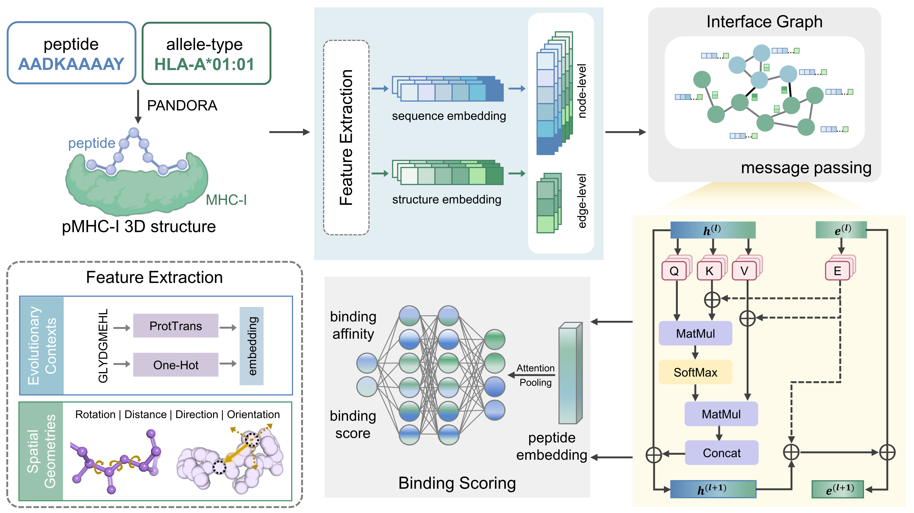

# GeoPMB

## Overview

We introduce GeoPMB, an interface-aware geometric deep learning framework designed for robust peptide-MHCI binding prediction by integrating evolutionary insights from protein language models with fine-grained geometric constraints. GeoPMB mitigates the overfitting common in sequence-based methods while capturing intricate geometric details often overlooked by coarse structure-based methods, enabling superior generalization to rare alleles and versatile application in antibody-antigen docking conformation ranking.



## Environments

Required dependencies and versions:

- python 3.8.16
- pytorch 1.13.1
- biopython 1.79
- sentencepiece 0.1.99
- transformers 4.39.3
- numpy 1.23.5
- torch-geometric 2.3.0
- pytorch-scatter 2.1.1
- pytorch-cluster 1.6.1

## Usage

### 1. Data Preparation

- Peptide-MHCI Datasets: The two benchmark pMHCI datasets used in our study are available in `/data`.
- Antibody-Antigen Data: All antibody-antigen pairs are available in `/data`, and complex structures can be downloaded from [SAbDab](http://opig.stats.ox.ac.uk/webapps/newsabdab/sabdab/).

### 2. Structure Modeling

GeoPMB requires 3D structural inputs. We utilize [PANDORA](https://github.com/X-lab-3D/PANDORA) to generate reliable 3D structures for peptide-MHCI pairs. Please ensure PANDORA is installed and configured correctly.

### 3. Featurization

Convert PDB structures into geometric graphs and extract evolutionary features. The implementation details are located in `/src/dataset/feature_utils.py`.

### 4. Inference

Inference commands using trained models (located in `/models`):

``` bash
python src/test.py \
    --dataset_path ./examples \
    --feature_path ./examples/Feature \
    --output_path ./outputs 
```
